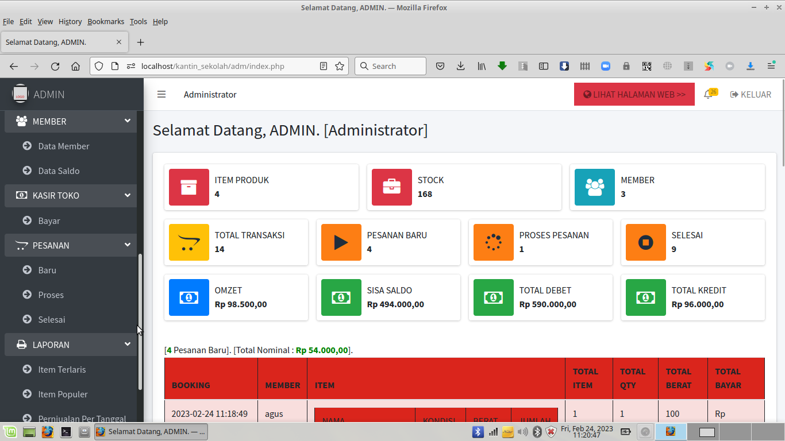

# Kantin-Sekolah v1.0

Kantin Sekolah v1.0 untuk Sistem Booking Item Produk dan Kasir Kantin/Minimarket di Sekolah.

Transaksi pembelian hanya bisa dilakukan, bila Siswa/Guru/Staff memiliki Saldo yang cukup untuk berbelanja.

Dibuat dengan Php Native Php 7.4.10 dan Mysql/MariaDB.

Pastikan gunakan Webserver XAMPP PHP 7.4.10 .

---

* Untuk File .SQL bisa import dari Folder /db

* File Konfigurasi di /inc/config.php

---

http://alamat_webnya/admin

Login Admin, Silahkan gunakan User : admin dan Password : admin

---

TAMPILAN HALAMAN WEB KANTIN SEKOLAH :

---

Bila ada kesulitan atau hambatan atau ingin request custom konten berbayar, 

silahkan bisa kontak via email : hajirodeon@gmail.com 

atau WA : 081-829-88-54

